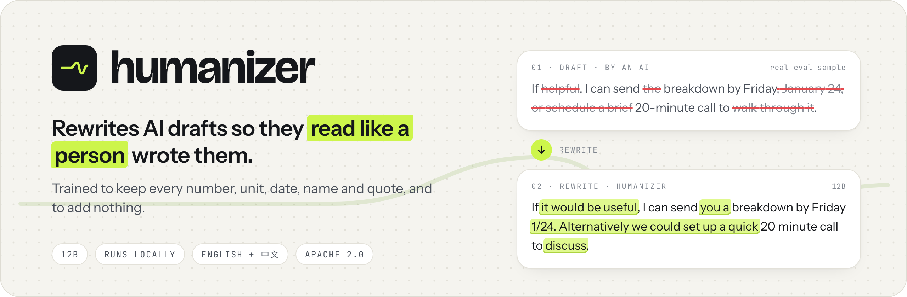
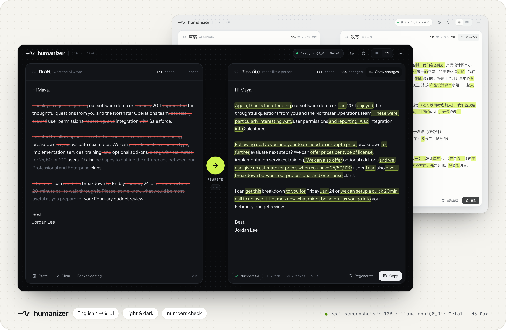
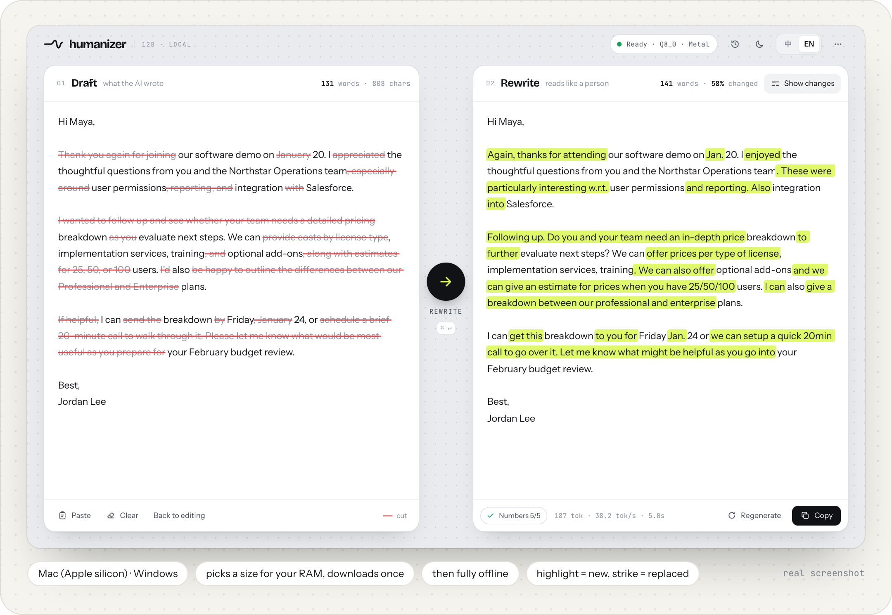
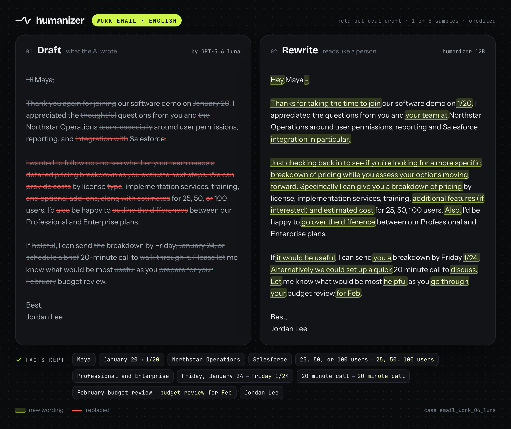
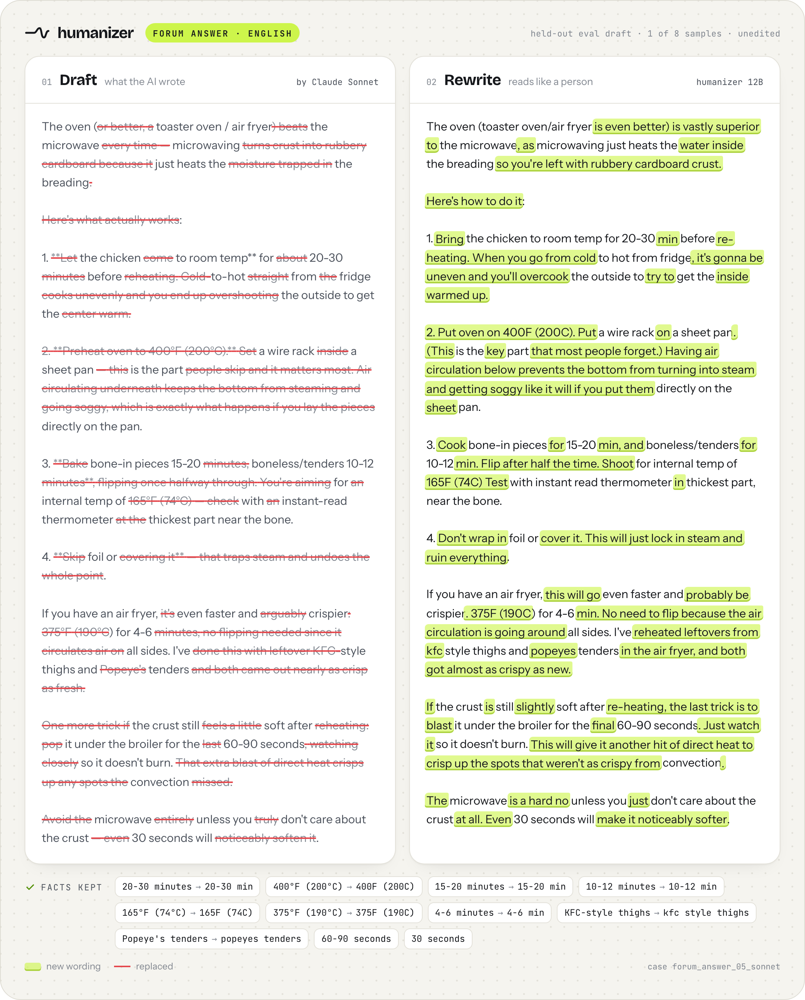
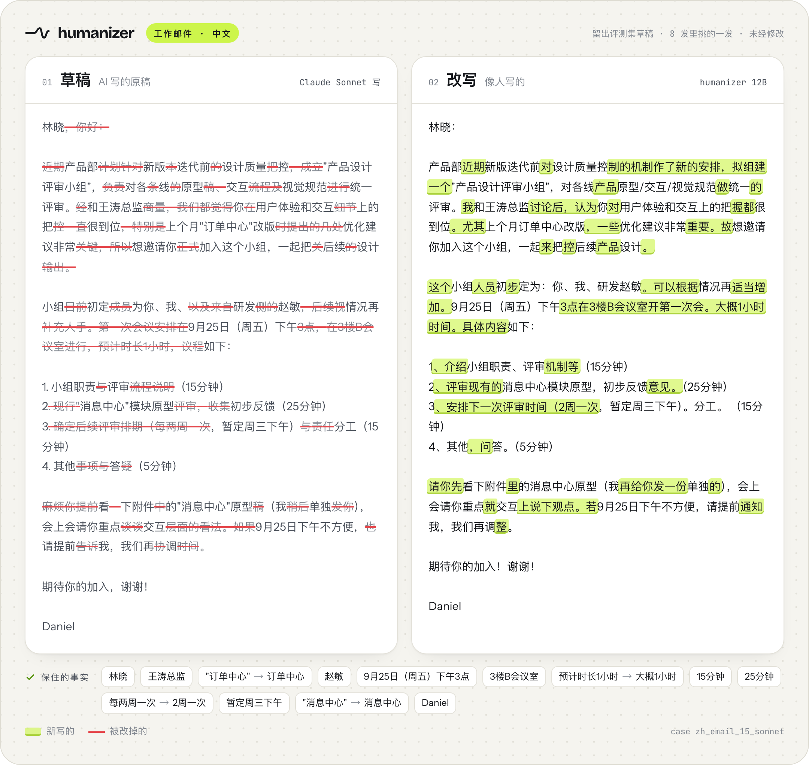
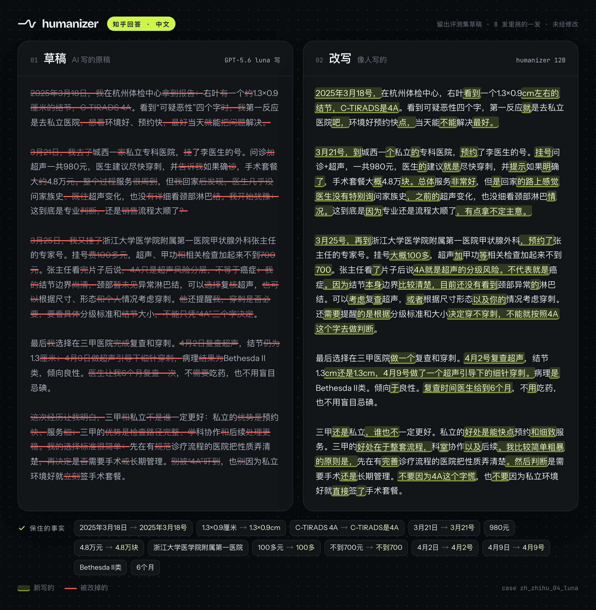
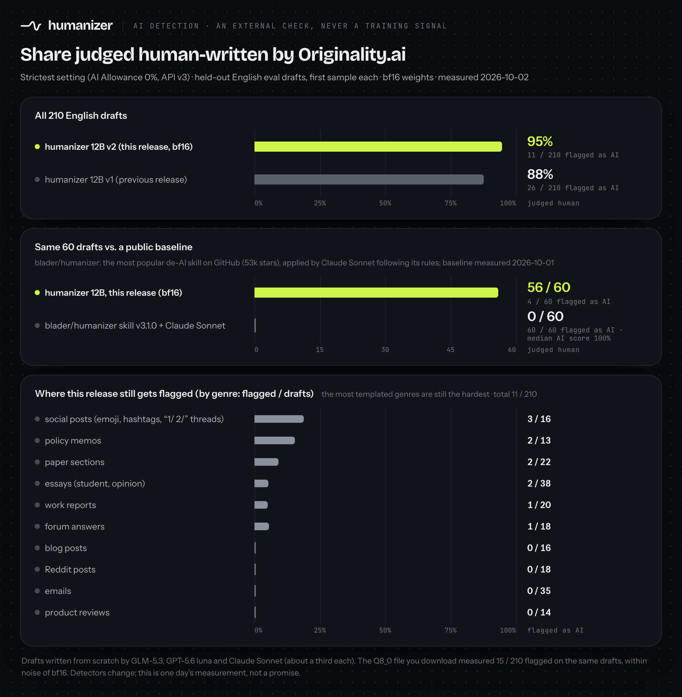
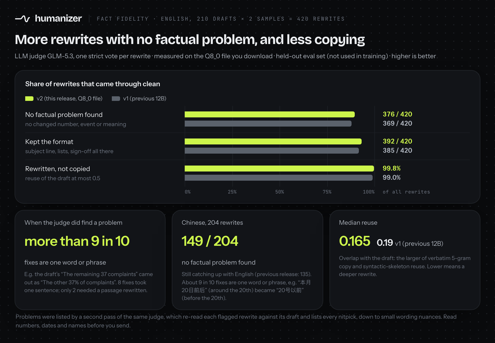
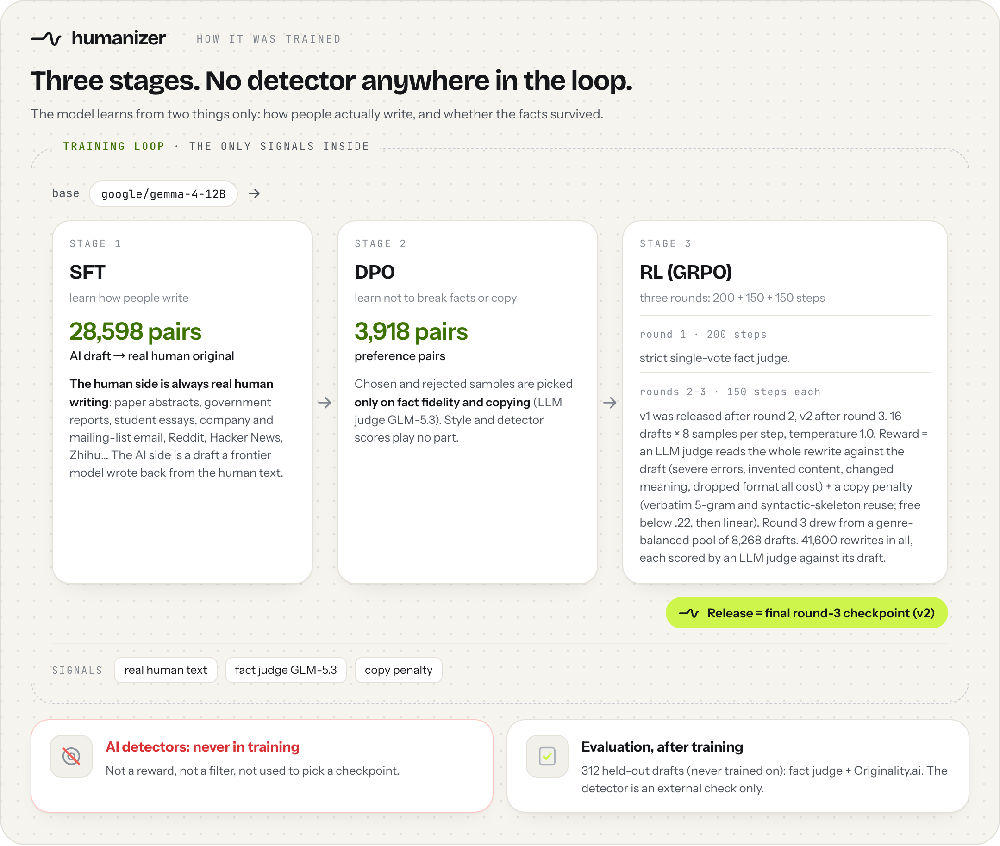

<p align="center">
  <a href="LICENSE"></a>
  <a href="https://huggingface.co/jialinyyzz/humanizer"></a>
  <a href="https://github.com/sgaofen/humanizer-local-model/releases/latest"></a>
  
  
</p>

<p align="center"><b>English</b> · <a href="README.zh.md">中文</a> · <a href="docs/USAGE.md"><b>Usage without the app</b></a> · <a href="docs/INSTALL.md">Install guide</a> · <a href="AGENTS.md">AGENTS.md</a></p>



**humanizer** is a 12B model that rewrites AI-written drafts (emails, essays, reports, forum posts; English and Chinese) so they read like a person wrote them. It is trained to keep every number, unit, date, name and quote, and to add nothing. It runs on your own machine. No AI detector was used anywhere in training.

> [!TIP]
> **Setting this up with an AI agent?** Point it at **[AGENTS.md](AGENTS.md)** (also [llms.txt](llms.txt)). It has the exact files to download, the server command, the prompt byte for byte, and a self-test.

**Contents:** [Quick start](#quick-start) · [Before and after](#before-and-after) · [Results](#results) · [How it was trained](#how-it-was-trained) · [Usage](#usage) · [Limitations](#limitations) · [License](#license)

## Quick start

### Option 1: the app (easiest)

| Your computer | Download |
|---|---|
| **Mac** with Apple silicon (M1 or newer) | [`Humanizer-0.3.1-macos-arm64.dmg`](https://github.com/sgaofen/humanizer-local-model/releases/download/app-v0.3.1/Humanizer-0.3.1-macos-arm64.dmg), or the newest from **[Releases](https://github.com/sgaofen/humanizer-local-model/releases/latest)** |
| **Windows** (x64) | [`Humanizer-0.3.1-windows-x64-setup.exe`](https://github.com/sgaofen/humanizer-local-model/releases/download/app-v0.3.1/Humanizer-0.3.1-windows-x64-setup.exe) (or the portable [`.zip`](https://github.com/sgaofen/humanizer-local-model/releases/download/app-v0.3.1/Humanizer-0.3.1-windows-x64-portable.zip)), or the newest from **[Releases](https://github.com/sgaofen/humanizer-local-model/releases/latest)** |

Double-click it and the app opens in your browser. On first run it looks at your memory, suggests a model size and downloads it once from Hugging Face. After that it works offline. Paste a draft on the left; the rewrite streams in on the right, with new wording highlighted and replaced wording struck through. On an M5 Max a hundred-word email takes about 3.6 seconds.

The app offers five sizes: Q8_0 (best), Q6_K (no measurable loss), Q4_K_M (slight loss), Q3 (small loss; a few more fact slips in English) and 2-bit (lowest AI-detector score; a few more fact slips). It suggests one for your memory, down to 8 GB machines; switch any time from the **…** menu → **Change model size**. Details: [which model size](docs/INSTALL.md#which-model-size).

**Updates:** the app checks GitHub and Hugging Face once a day (you can turn that off) and shows a small hint in the top bar when a new version or a newer model file is out. **…** → **Check for updates** shows what changed and updates in one click; your model, settings and history stay. Details: [updates](docs/INSTALL.md#updates).

The app is not code-signed yet, so macOS and Windows will warn you the first time. The one-time fix is in [docs/INSTALL.md](docs/INSTALL.md#first-launch-warnings).



<sub>Real screenshots of the app running the 12B model (llama.cpp Q8_0, Metal, M5 Max). The speed in the bottom bar is real.</sub>

### Option 2: one command (llama.cpp)

```bash
# 1) start a local server; the first run downloads humanizer-12b-Q8_0.gguf (about 12.7 GB)
#    16 GB machine: use humanizer-12b-Q6_K.gguf (about 10.0 GB) instead; less memory:
#    humanizer-12b-Q4_K_M.gguf (7.6 GB), humanizer-12b-Q3-QAT.gguf (5.6 GB) or humanizer-12b-IQ2_XS-QAT.gguf (3.9 GB)
llama-server --hf-repo jialinyyzz/humanizer --hf-file humanizer-12b-Q8_0.gguf -c 8192 -np 1 -ngl 99 --port 8080

# 2) in another terminal: rewrite draft.txt (needs curl and jq)
curl -sLO https://huggingface.co/jialinyyzz/humanizer/resolve/main/prompt_format.json
jq -n --rawfile d draft.txt --slurpfile f prompt_format.json \
  '{prompt: ($f[0].instr + "\n\n" + ($d | sub("^\\s+"; "") | sub("\\s+$"; "")) + $f[0].sep),
    temperature: 1.0, top_p: 0.95, top_k: 0, min_p: 0, repeat_penalty: 1.0, n_predict: 2048}' \
| curl -s http://127.0.0.1:8080/completion -d @- | jq -r .content
```

This is a plain text-completion model, not a chat model. Use `/completion`, not `/v1/chat/completions`. See [Prompt format](#prompt-format) before wiring it into anything else.

### Option 3: the command line, `hz` (for agents and long documents)

`hz` rewrites a whole file in one command: a short draft, a long Markdown document or a `.docx`. It uses the app from Option 1 or the llama-server from Option 2 (it starts the installed app on macOS if it is closed), keeps headings, code blocks, tables and links as they are, rewrites the prose piece by piece, and checks every piece for lost numbers and copying. Python 3.8 or newer, no dependencies.

```bash
pipx install git+https://github.com/sgaofen/humanizer-local-model     # or: pip install git+https://github.com/sgaofen/humanizer-local-model
hz draft.txt                          # prints the rewrite
hz paper.md -o paper.out.md           # long Markdown: structure kept, prose rewritten in pieces
hz report.docx -o report.out.docx     # .docx needs python-docx: pipx inject humanize-model python-docx
hz paper.md --json                    # stats per piece for scripts and agents
```

On stderr it lists every piece where a number from the draft is missing in the rewrite or a new number appeared, so you know where to look. Read the whole result anyway: names and the meaning of a sentence are not checked, and no detector result is promised. In a `.docx`, each rewritten paragraph takes the formatting of its first run, so bold or italic inside a paragraph is lost. On an M5 Max with the app, a 1,200-word Markdown article took 41 to 54 seconds. Details: [USAGE.md, section 14](docs/USAGE.md#14-hz-command-line-tool).

> [!IMPORTANT]
> **Not using the app? Read [docs/USAGE.md](docs/USAGE.md) (Usage without the app).** It has complete, copy-paste steps for llama.cpp (server and one-shot), MLX, transformers, vLLM, Ollama and LM Studio, a script that rewrites a whole folder, how to handle long documents and Chinese, and a troubleshooting table.

## Before and after

Four drafts from the held-out evaluation set (never seen in training). For each draft we generated 8 samples with this release's `humanizer-12b-Q8_0.gguf` file (llama.cpp, the app's settings) and picked the one that reads best among those the fact judge passed. The right side is that sample, **not edited**; only whitespace is normalised for display. All 8 samples per draft are in [eval/outputs/examples-12b-Q8_0_x8.json](eval/outputs/examples-12b-Q8_0_x8.json). Highlight = new wording, strikethrough = draft wording that was replaced. We also checked every number and name in these four by hand.

These are picks, not every sample. Across the whole evaluation set the model still changes details: the judge flagged 44 of the 420 English rewrites, 135 problems in all, and 125 of them are a single word or phrase (the draft's "The remaining 37 complaints" came out as "The other 37% of complaints"). **Read the result before you send it, especially numbers, dates and names.** Details in [Results](#results).





<details>
<summary><b>Two Chinese examples</b> (work email, Zhihu answer)</summary>




</details>

## Results

All numbers come from our own evaluation set: **312 drafts** (210 English, 102 Chinese) across 18 genres: emails, emails to professors, work reports, policy memos, paper sections, student essays, opinion essays, blog posts, Reddit posts, forum answers, product reviews and social posts; in Chinese, emails, Zhihu answers, personal essays, social posts, reports and paper sections. Three frontier models wrote the drafts from scratch, about a third each: GLM-5.3, GPT-5.6 luna and Claude Sonnet. None of them were used in training. Each draft was rewritten twice. Every output and every verdict is in [eval/](eval/).

### AI detection (an external check)



**95% judged human.** Originality.ai, API v3, **AI Allowance 0% (its strictest setting)**, measured **2026-10-02** on the **210 English drafts**, first sample of each, **bf16 weights**: **11 of 210 rewrites were flagged as AI**.

| Model | Flagged as AI | Judged human |
|---|---|---|
| **humanizer 12B v2, this release (bf16)** | **11 / 210 (5%)** | **95%** |
| humanizer 12B v1, previous release | 26 / 210 (12%) | 88% |

This release is flagged less than half as often as the previous one. On the same drafts, 20 were flagged only for the previous release and 5 only for this one (paired test, p = 0.004). The `humanizer-12b-Q8_0.gguf` file you download measured 15 / 210 (7%) on the same drafts, within noise of bf16 (paired test, p = 0.48).

**Public baseline.** [`blader/humanizer`](https://github.com/blader/humanizer) (v3.1.0, 53k stars) is the most popular de-AI skill on GitHub. We had Claude Sonnet rewrite the same 60 drafts following its rules: **60 / 60 were flagged as AI** (median AI score 100%). This release (bf16) on the same 60 drafts: **4 / 60 flagged**. The two are different kinds of tool (a rule list for a general model vs. a fine-tuned rewriter), so read this as a comparison of outcomes on the same inputs, not of methods.

**Where it still fails.** The most templated genres are still the hardest:

| Genre | Flagged as AI |
|---|---|
| Social posts with emoji, hashtags or "1/ 2/" threads | **3 / 16** |
| Formal policy memos | **2 / 13** |
| Paper sections | 2 / 22 |
| Essays (student and opinion) | 2 / 38 |
| Work reports | 1 / 20 |
| Forum answers | 1 / 18 |
| Blog posts | 0 / 16 |
| Reddit posts | 0 / 18 |
| Emails (work and to professors) | 0 / 35 |
| Product reviews | 0 / 14 |
| **All** | **11 / 210** |

Detectors change over time; this is what one detector said on one date, not a promise about any other detector or date.

### Fact fidelity



**376 of 420 English rewrites came back with no factual problem** from a strict LLM judge (GLM-5.3, one vote per rewrite; 210 drafts × 2 samples), measured on the `humanizer-12b-Q8_0.gguf` file you download. The previous release: 369 of 420.

| | **v2, this release (Q8_0 file)** | v1, previous 12B release |
|---|---|---|
| No factual problem found (no changed number, event or meaning; higher is better) | **376 / 420** | 369 / 420 |
| Dropped a format element (e.g. subject line, list, sign-off; lower is better) | **28 / 420** | 35 / 420 |
| Median reuse (overlap with the draft; lower is better) | **0.165** | 0.19 |
| Outputs that reuse more than half the draft (reuse > 0.5; lower is better) | **0.2%** | 1.0% |

*Reuse* is the larger of verbatim 5-gram copy and syntactic-skeleton reuse; lower means a deeper rewrite.

**When the judge did find a problem, the fix is usually small.** A second pass of the same judge re-read every flagged rewrite against its draft and listed each problem with how much it takes to fix. It lists every nitpick it can find, down to small wording nuances. More than 9 in 10 of the fixes it listed (125 of 135) are a single word or short phrase, like the draft's "The remaining 37 complaints" coming out as "The other 37% of complaints". 8 take one sentence; 2 need a passage rewritten.

**Chinese is still catching up with English.** The judge found no factual problem in **149 of 204** Chinese rewrites (previous release: 135; 7 of the other 55 only added a little content). Where it did, about 9 in 10 fixes (212 of 236) are a single word or phrase: "本月20日前后" (around the 20th of this month) became "20号以前" (before the 20th). 21 take one sentence; 3 need a passage rewritten.

**Note: the fact judge is deliberately strict.** In a separate audit of the same judge model, a second judge (Claude Opus) re-read 150 rewrites it had flagged as serious (drawn from training, not from this evaluation set). On the fact the first judge pointed to, Opus agreed it was a serious error in 99, rated it minor in 41 (for example "may reduce" became "will help decrease", or a long name was shortened), and found the fact unchanged in 10. So some flags are harmless rewording. Still read numbers, dates and names before you send.

**Still, read the result before you send it**, especially numbers, dates, names and the direction of every claim. The app checks that every number in the draft also appears in the rewrite and flags the ones that don't (Arabic digits only).

## How it was trained



**No AI detector was used anywhere in training:** not as a reward, not as a filter, not to pick a checkpoint. The model learns from how people actually write and from whether the facts survived. Detector numbers on this page are only an external check.

1. **Supervised fine-tuning, 28,598 pairs** of *AI draft → real human original*. The human side is always real human writing: paper abstracts, government reports, student essays, company and mailing-list email, Reddit, Hacker News, Zhihu and more. The AI side is a draft that a frontier model wrote back from the human text.
2. **DPO, 3,918 preference pairs**, chosen only on fact fidelity and on how much the output copies the draft (LLM judge GLM-5.3).
3. **Reinforcement learning (GRPO) in three rounds, 500 steps in total.** Round 1, 200 steps, with a strict single-vote fact judge. Rounds 2 and 3, 150 steps each (v1 was released after round 2, v2 after round 3): 16 drafts × 8 samples per step at temperature 1.0. The reward is an LLM judge that reads the whole rewrite against the draft and penalises severe errors, invented content, changed meaning and dropped formatting, plus a copy penalty on verbatim 5-gram and syntactic-skeleton reuse (free below .22, then linear). Round 3 drew its drafts from a genre-balanced pool of 8,268. In all, RL produced 41,600 rewrites, each scored by an LLM judge against its draft.
4. **This release (v2) is the final round-3 checkpoint.**

The training code will be released later.

## Usage

**The complete guide is [docs/USAGE.md](docs/USAGE.md)** (also on [Hugging Face](https://huggingface.co/jialinyyzz/humanizer/blob/main/USAGE.md)): every runtime step by step, a batch script, long documents, Chinese, troubleshooting. The essentials follow.

### Files on Hugging Face

| File | Size | For |
|---|---|---|
| `humanizer-12b-Q8_0.gguf` | about 12.7 GB | 32 GB of memory or more. Recommended. |
| `humanizer-12b-Q6_K.gguf` | about 10.0 GB | 16 GB of memory. |
| `humanizer-12b-Q4_K_M.gguf` | about 7.6 GB | About 14 GB of memory, or when disk is tight. Quantization-aware trained. |
| `humanizer-12b-Q3-QAT.gguf` | about 5.6 GB | 12 GB of memory. 3-bit class, quantization-aware trained; a few more fact slips in English than Q4_K_M (see below). |
| `humanizer-12b-IQ2_XS-QAT.gguf` | about 3.9 GB | 8 GB of memory; the smallest. 2-bit; more fact mistakes than the larger files (see below). |
| `humanizer-12b-bf16.gguf` | about 23.8 GB | Unquantised weights as one GGUF, for reference or for quantising yourself. |
| `model.safetensors` + `config.json`, `generation_config.json`, `tokenizer.json`, `tokenizer_config.json` | about 24 GB (bf16) | transformers, vLLM, converting to MLX. |
| `prompt_format.json` | tiny | The instruction and separator, verbatim. |

### Quantized versions

All GGUF files, with this table and how they were made, are also in their own repo: **[jialinyyzz/humanizer-GGUF](https://huggingface.co/jialinyyzz/humanizer-GGUF)**. The same files stay in `jialinyyzz/humanizer`, so the download commands here keep working.

| File | In short | Bits / type | Size | Peak memory (Mac) ¹ | KL to bf16, EN / ZH ² | Standard `llama-quantize` build, same size class: KL EN / ZH (top token same) ² | Top token same as bf16, EN / ZH ² | Fact check (GLM): rewrites flagged · spots listed ³ | Flagged as AI, same 60 drafts ⁵ |
|---|---|---|---|---|---|---|---|---|---|
| `humanizer-12b-bf16.gguf` | Reference (full precision) | 16-bit (bf16) | 23.8 GB | about 24.8 GB (est.) | 0 (reference) | | 100% (reference) | EN 52 · 160 spots <br> ZH 50 · 216 spots | 4 / 60 |
| `humanizer-12b-Q8_0.gguf` | **Best quality** | 8-bit (Q8_0) | 12.7 GB | 13.7 GB | 0.0017 / 0.0017 | same file: Q8_0 is a standard build | 98.45% / 98.25% | EN 44 · 135 spots <br> ZH 54 · 236 spots | 7 / 60 |
| `humanizer-12b-Q6_K.gguf` | No measurable loss | 6-bit (Q6_K) | 10.0 GB | about 11.0 GB (est.) | 0.0031 / 0.0035 | same file: Q6_K is a standard build | 97.95% / 97.48% | EN 56 · 153 spots <br> ZH 56 · 255 spots | not measured |
| `humanizer-12b-Q4_K_M.gguf` | Slight loss | 4-bit (Q4_K_M), quantization-aware trained | 7.6 GB | 10.0 GB | **0.0136 / 0.0146** | Q4_K_M, 7.6 GB: 0.0203 / 0.0225 (94.46% / 93.46%) | 95.62% / 94.77% | EN 58 · 162 spots <br> ZH 51 · 194 spots <br> (standard Q4_K_M: EN 56 · 163, ZH 48 · 218) | not measured |
| `humanizer-12b-Q3-QAT.gguf` | Small loss; a few more fact slips in English | 3-bit class, mixed precision (about 3.9 bits per weight) ⁴, quantization-aware trained | 5.6 GB | 8.0 GB | **0.0300 / 0.0318** ² | IQ3_XXS (3-bit), 4.7 GB: 0.138 / 0.190 (85.72% / 82.55%) | 93.63% / 92.64% | EN 64 · 210 spots <br> ZH 53 · 233 spots | 4 / 60 |
| `humanizer-12b-IQ2_XS-QAT.gguf` | Lowest AI-detector score; a few more fact slips (mostly single words or numbers): check numbers and names before sending | 2-bit (mostly IQ2_XS) ⁴, quantization-aware trained | 3.9 GB | 6.2 GB | **0.106 / 0.106** ⁴ | IQ2_XS, 3.8 GB: 0.474 / 0.769 (74.43% / 65.53%) | 87.72% / 87.07% | EN 70 · 265 spots <br> ZH 66 · 361 spots | 0 / 60 |

**What KL means:** how far a file's next-word probabilities drift from the full bf16 model, averaged over every word of real drafts and rewrites. Lower is better; 0 means identical. "Top token same" is how often the file and bf16 would pick the same most likely next word. "Standard" means a plain `llama-quantize` run of the same type with the same importance matrix our build started from, with no extra training.

The Q4_K_M was refined with quantization-aware training on 2026-10-04: same size and format, about 1/3 lower KL than the standard Q4_K_M. The 2-bit build is closer to the full model than a standard 3-bit build that is 0.8 GB larger, and Chinese, which plain 2-bit quantization hurts most, comes out the same as English. It still makes more fact mistakes than the larger files (see ³), so use it only when memory is tight and check its output with extra care.

The Q3 build (added 2026-10-05) sits between them: at 5.6 GB it is 2 GB smaller than Q4_K_M, and its KL, about 0.03 in both languages, is a fraction of a standard 3-bit IQ3_XXS (0.138 / 0.190), which is 0.9 GB smaller. Its Chinese fact check and its AI-detector result are on par with bf16. In English it makes a few more fact slips (64 of 420 rewrites flagged, against 52 for bf16 and 58 for Q4_K_M), almost all a single word or phrase, so check numbers and names before you send.

¹ Maximum resident memory of llama-server (llama.cpp, Metal) on an Apple M5 Max with the app's settings (8,192-token context, one request at a time) while rewriting. Q4_K_M, Q3 and 2-bit were measured side by side with the app's llama.cpp build on four real drafts; generation ran at about 52, 65 and 69 tokens per second. Q8_0 was measured in an earlier run on one 470-token draft, which read about 1.3 GB lower for the same file (2-bit: 4.9 GB there, 6.2 GB here), so it may need a little more than shown; Q6_K and bf16 are estimated (est.). A 32,768-token context adds about 0.4 GB. Leave room for the system and other apps (the app keeps about 4 GB free).
² llama.cpp `llama-perplexity --kl-divergence`, 30 chunks of 2,048 tokens per language (about 30,700 scored tokens each) of held-out drafts and rewrites from the evaluation set (no overlap with calibration or training data), reference = the bf16 GGUF, measured on A100 and A30 GPUs (the same file measures within about 3% across GPU models, far below the gaps between files). A full comparison with standard llama.cpp quantization and a third-party imatrix GGUF, IQ1_M to Q8_0, is on the [GGUF page](https://huggingface.co/jialinyyzz/humanizer-GGUF#how-it-compares-to-standard-quantization). Q8_0, Q6_K and Q4_K_M keep the token embeddings and output layer at 8-bit; the IQ2_XS and IQ3_XXS comparison builds use 4-bit embeddings.
³ The strict fact judge from [Results](#fact-fidelity) (GLM-5.3, one vote per rewrite) on all 420 English and 204 Chinese rewrites (two per draft; for bf16, 4 Chinese rewrites could not be judged). "Rewrites flagged" = rewrites it found a factual problem in; a second pass re-read each flagged rewrite against its draft and listed every problem ("spots"). Most spots are a single word, number or phrase: about 9 in 10 for every file (2-bit: 243 of 265 English, 330 of 361 Chinese). Compared draft by draft with Q8_0, Q6_K and Q4_K_M are within noise, and the quantization-aware Q4_K_M is within noise of the standard one. The 2-bit build is not: in English it was flagged on 70 rewrites against 44 for Q8_0 on the same drafts, a difference beyond noise; in Chinese 66 against 54, within noise. Against the Q4_K_M it is 70 vs. 58 and 66 vs. 51, within noise. Q3: 64 English rewrites flagged (bf16 52, Q4_K_M 58), and 191 of its 210 English spots are a single word or short phrase; in Chinese 53 (bf16 50).
⁴ The Q3 and 2-bit builds keep about 130,000 of the 262,144 vocabulary tokens: the ones English and Chinese text actually uses, plus everything needed to spell any input. Any text still encodes and decodes exactly; rare symbols, emoji and other scripts just take a few more tokens. Pruning alone moves the model by KL 0.0013 (English) / 0.0002 (Chinese), and their KL above is measured against a bf16 with the same pruned vocabulary. Bits are spread by sensitivity: the 2-bit build is mostly IQ2_XS, with 3- and 4-bit types where they matter; in the Q3 build about half the bytes are Q4_K and a fifth Q6_K, with IQ3_XXS and IQ2_XS on the least sensitive tensors (about 3.9 bits per weight on average). Then each layer is tuned with quantization-aware training and the scales are distilled from the bf16 model on English and Chinese rewriting data. The files report their types as IQ2_XS and IQ3_XXS, but neither is a plain build of that type.
⁵ The 2-bit build had the best AI-detector result of all versions: 0/60 flagged (Q8_0 7/60, bf16 4/60; Originality.ai strictest setting). A likely reason: the small drift from quantization makes the wording a bit less predictable, which detectors read as less machine-like. Q3: 4/60, the same as bf16 (3 drafts flagged only with Q3, 3 only with bf16).

sha256 checksums are in [USAGE.md](https://github.com/sgaofen/humanizer-local-model/blob/main/docs/USAGE.md#2-pick-a-file).

### Prompt format

**This is a text-completion model, not a chat model.** There is no system prompt and there are no turn markers. Send exactly this text and let the model continue:

```
Rewrite the text below so it reads like a person wrote it, not a language model.

Reorganize it as you see fit. Vary sentence length on purpose. Cut hedging,
throat-clearing, and any sentence that only announces what comes next.
Prefer the concrete word over the abstract one. It is fine to sound uneven.

Every fact, number, unit, date, name and quotation must survive unchanged.

<YOUR DRAFT, with leading and trailing whitespace removed>

### Rewritten:

```

In code: `prompt = INSTR + "\n\n" + draft.strip() + "\n\n### Rewritten:\n\n"`. `INSTR` is the first block above (ending at "unchanged.", no trailing newline). It is also in `prompt_format.json` (`instr`, `sep`) and in [`humanizer/promptfmt.py`](humanizer/promptfmt.py).

- **Byte for byte.** The model was trained on this exact wrapper. A reworded instruction or a missing blank line makes it worse. To check your builder: the first 16 hex characters of `sha256(build_prompt("X"))` must be `cc51d66b4c593fbe`.
- **Stop on EOS only.** Don't pass `"###"` as a stop string; it truncates the rare output that contains it.
- **Sampling:** temperature 1.0, top-p 0.95, nothing else (top-k off, min-p off, repetition penalty 1.0). llama-server turns on top-k 40 and min-p 0.05 by default, so switch them off as in the example above.
- Allow about 2.5× the draft's token count for the output (the app uses 256 to 2048 tokens).
- **Built-in defaults:** since 2026-10-04 every GGUF file also stores these sampling settings in its metadata, so llama.cpp and apps built on it use them when a request sets none.
- **Chat front ends:** since 2026-10-04 the GGUF files carry a chat template that builds exactly this prompt from the last user message (system prompts and earlier turns are ignored). llama-server's `/v1/chat/completions` (with `--jinja`, the default in recent builds) then works, one draft per message: with the same seed it gave the same rewrite as the completion endpoint. Chat apps that use the file's template, such as LM Studio's Chat tab, should work the same way (not tested by us). Files downloaded earlier have no template, and the safetensors weights have none either.

### llama.cpp

Install llama.cpp ([releases](https://github.com/ggml-org/llama.cpp/releases), `brew install llama.cpp`, or `winget install llama.cpp`), start `llama-server` as in [Quick start](#option-2-one-command-llamacpp) (`-np 1` gives the whole 8192-token context to one request), then call it from any language. Python, standard library only:

```python
import json, urllib.request

pf = json.load(open("prompt_format.json"))
draft = open("draft.txt", encoding="utf-8").read()
body = {"prompt": pf["instr"] + "\n\n" + draft.strip() + pf["sep"],
        "temperature": 1.0, "top_p": 0.95, "top_k": 0, "min_p": 0, "repeat_penalty": 1.0,
        "n_predict": 2048}
req = urllib.request.Request("http://127.0.0.1:8080/completion", json.dumps(body).encode(),
                             {"Content-Type": "application/json"})
print(json.load(urllib.request.urlopen(req))["content"].strip())
```

The app ships llama.cpp build `b11335`.

### MLX (Apple silicon)

```bash
pip install mlx-lm        # we used mlx-lm 0.32.0
mlx_lm.convert --hf-path jialinyyzz/humanizer --mlx-path humanizer-mlx-8bit -q --q-bits 8 --q-group-size 64
```

```python
import json
from huggingface_hub import hf_hub_download
from mlx_lm import load, generate
from mlx_lm.sample_utils import make_sampler

pf = json.load(open(hf_hub_download("jialinyyzz/humanizer", "prompt_format.json")))
model, tok = load("humanizer-mlx-8bit")
draft = open("draft.txt", encoding="utf-8").read()
print(generate(model, tok, prompt=pf["instr"] + "\n\n" + draft.strip() + pf["sep"],
               max_tokens=2048, sampler=make_sampler(temp=1.0, top_p=0.95)))
```

### transformers (CUDA)

```python
import json, torch
from huggingface_hub import hf_hub_download
from transformers import AutoModelForCausalLM, AutoTokenizer

repo = "jialinyyzz/humanizer"
pf = json.load(open(hf_hub_download(repo, "prompt_format.json")))
tok = AutoTokenizer.from_pretrained(repo)
model = AutoModelForCausalLM.from_pretrained(repo, dtype=torch.bfloat16, device_map="auto")

draft = open("draft.txt", encoding="utf-8").read()
ids = tok(pf["instr"] + "\n\n" + draft.strip() + pf["sep"], return_tensors="pt").to(model.device)
out = model.generate(**ids, do_sample=True, temperature=1.0, top_p=0.95, top_k=0, max_new_tokens=2048)
print(tok.decode(out[0, ids["input_ids"].shape[1]:], skip_special_tokens=True).strip())
```

The weights were saved with transformers 5.14.1. Keep `top_k=0`: it switches off the top-k 64 default in the bundled `generation_config.json`, matching the app, which samples without top-k.

### vLLM, Ollama and LM Studio

**vLLM:** see [docs/USAGE.md#6-vllm](docs/USAGE.md#6-vllm). Pass `top_k=-1` (off) in `SamplingParams`; for `vllm serve`, add `--generation-config vllm` so the top-k 64 in `generation_config.json` isn't used as a default.

We have not tested Ollama or LM Studio ourselves; full steps are in [docs/USAGE.md](docs/USAGE.md#7-ollama).

**Ollama** ignores the chat template stored in the GGUF and would wrap your text in its own Gemma template, which breaks this model. Create the model with this `Modelfile`: its template takes the last user message as the draft and builds the prompt above (we rendered it with Go's `text/template` and got the prompt byte for byte, but have not run it in Ollama). Then `ollama run humanizer` or `/api/chat` with one draft per message, or `/api/generate` with `"raw": true` and the full prompt.

```
FROM ./humanizer-12b-Q8_0.gguf
TEMPLATE """{{- $draft := "" }}{{- range .Messages }}{{- if eq .Role "user" }}{{- $draft = .Content }}{{- end }}{{- end }}Rewrite the text below so it reads like a person wrote it, not a language model.

Reorganize it as you see fit. Vary sentence length on purpose. Cut hedging,
throat-clearing, and any sentence that only announces what comes next.
Prefer the concrete word over the abstract one. It is fine to sound uneven.

Every fact, number, unit, date, name and quotation must survive unchanged.

{{ $draft }}

### Rewritten:{{ "\n\n" }}"""
PARAMETER temperature 1.0
PARAMETER top_p 0.95
PARAMETER top_k 0
PARAMETER min_p 0
PARAMETER repeat_penalty 1.0
PARAMETER num_ctx 8192
PARAMETER num_predict 2048
```

```bash
ollama create humanizer -f Modelfile
```

**LM Studio:** with a GGUF downloaded on or after 2026-10-04, the Chat tab should work: empty system prompt, one draft per message, sampling as above. Any download also works through the local server's text-completion endpoint `/v1/completions` with the full prompt.

### Speed

Measured on an M5 Max:

| Runtime | Speed | Example |
|---|---|---|
| llama.cpp Q8_0, Metal (what the app uses) | about 36–38 tokens/s | an email of about a hundred words: about 3.6 s; a Chinese email of about 300 characters: about 8.5 s |
| MLX 8-bit | about 30 tokens/s (English), 38 tokens/s (Chinese) | an email of about a hundred words: about 9 s |

## Limitations

- **It can still change a detail.** A strict LLM judge found no factual problem in 376 of 420 English rewrites; where it found one, more than 9 in 10 fixes are a single word or phrase, such as "37 complaints" becoming "37% of complaints". Read the result before you send it, especially numbers, dates and names.
- **Chinese is still catching up with English:** no factual problem in 149 of 204 Chinese rewrites; where there was one, about 9 in 10 fixes are a single word or phrase.
- **Templated genres are still the hardest for detectors:** social posts with emoji, hashtags or numbered threads (3/16 flagged) and formal policy memos (2/13).
- **Formatting is not always kept.** 28 of 420 outputs dropped a format element. Paragraph breaks and list or heading markup sometimes change.
- **Occasionally answers in the wrong language.** On short, informal English drafts with technical jargon, the model occasionally writes the whole rewrite in Chinese. The app (0.3.1 and later) and `hz` check the language and sample again automatically (a Chinese draft that comes back in English is caught too). If you call the model yourself through llama.cpp or another runtime: when an English draft comes back with more than a few Chinese characters, sample once more with the same settings.
- **Register can drift in casual genres.** In Reddit-style posts it sometimes adds slang or profanity that wasn't in the draft.
- **Detectors change.** The detection numbers above are one measurement on one date. Nothing here guarantees a result on any detector.
- **The app** doesn't resample when a rewrite copies too much of the draft; press *Regenerate*. It is not code-signed yet, and the Windows build has not been run on real Windows hardware yet (CI smoke tests only).
- It is a writing tool for your own drafts. Where a school, employer or publication has rules about AI assistance, follow them.

## License

Code and weights: [Apache License 2.0](LICENSE).

humanizer is fine-tuned from [google/gemma-4-12B](https://huggingface.co/google/gemma-4-12B), which Google releases under Apache 2.0. This project is not affiliated with or endorsed by Google. The training data is not redistributed. <!-- TBD: confirm the reason/wording for not releasing training data -->

This repository was previously `sgaofen/humanizer`, and the model repository was previously `jialinyyzz/humanizer-gemma-4-e4b` (an earlier, smaller model that is no longer offered; its files are in the Hugging Face commit history). The first 12B release (v1, 2026-10-01) is also in the commit history; the current model is v2 (2026-10-02).

Links: [Hugging Face](https://huggingface.co/jialinyyzz/humanizer) · [App releases](https://github.com/sgaofen/humanizer-local-model/releases/latest) · [Install guide](docs/INSTALL.md) · [AGENTS.md](AGENTS.md) · [llms.txt](llms.txt)
