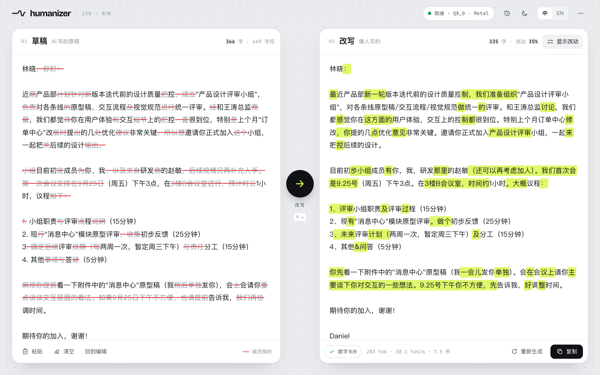
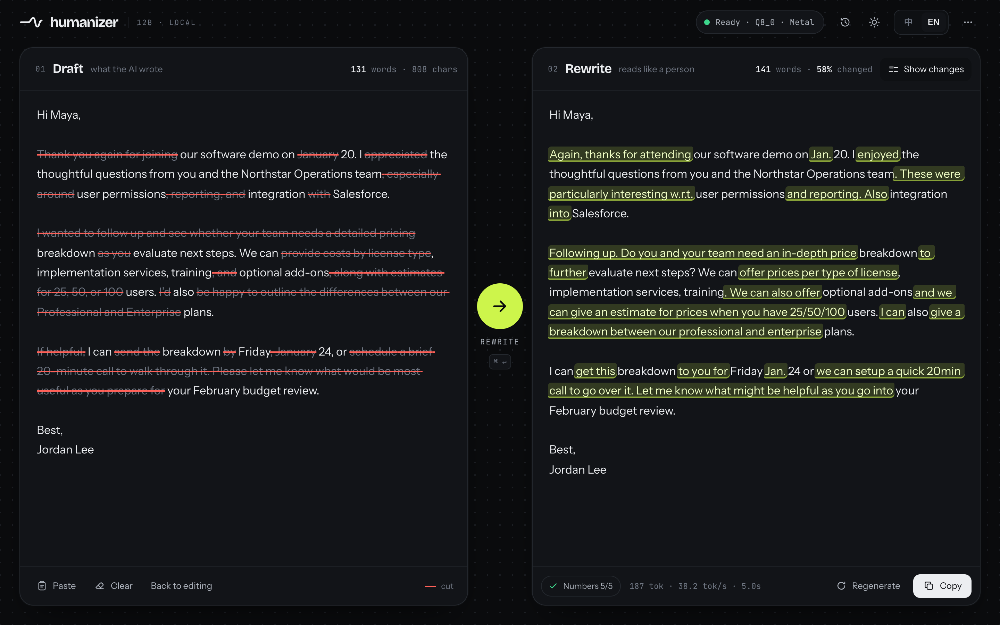

# Humanizer App

把 humanizer 改写模型做成一个双击就能用的本地网页 App:第一次打开自动按内存选档、下载 GGUF,之后完全离线。左边贴 AI 写的草稿,右边流式出改写,改完用荧光笔标出新写的部分、在原稿上划掉被改掉的部分。

| 改写完成(中文 · 浅色) | 改写完成(English · dark) |
|---|---|
|  |  |

更多:`docs/screenshots-real/` 里还有 `editor-en-light.png`、`editor-zh-dark.png`、`mobile-en-light.png`。
这些是 /Applications/Humanizer.app 加载 12B 的 llama.cpp Q8_0 GGUF(Metal,M5 Max)真机实拍,底栏里的速度是真实的。

---

## 用户视角

1. 下载 `Humanizer-<版本>-macos-arm64.dmg`(Apple 芯片)或 `Humanizer-<版本>-windows-x64-setup.exe`(或便携 zip)。
2. 双击 Humanizer → 浏览器自动打开 `http://127.0.0.1:47615/`。
3. 第一次:页面显示本机内存和推荐档位,点「下载」。断网、关页面、退出 App 都能续传;下完校验 sha256,自动装载。
4. 之后每次双击都直接进编辑器。App 没有窗口、也不在 Dock / 任务栏里;退出在网页右上角「…」菜单。网页关掉 30 分钟后 App 自动退出、释放内存。

### 没有签名时的系统拦截(目前就是这样)

- **macOS**:没有 Apple Developer ID,首次打开会提示「无法验证开发者 / 无法确认没有恶意软件」。处理:双击一次后去「系统设置 → 隐私与安全性」点「仍要打开」;或终端执行 `xattr -dr com.apple.quarantine /Applications/Humanizer.app`。dmg 里附了一份《打不开怎么办.txt》。macOS 15 起右键「打开」已经绕不过去,只能走系统设置。
- **Windows**:安装包没签名,SmartScreen 会弹「Windows 已保护你的电脑」,点「更多信息 → 仍要运行」。下载量少的新签名证书也会被 SmartScreen 拦一段时间,只有 EV 证书或 Azure Trusted Signing 能比较快消掉。

---

## 架构

```
浏览器 (web/, 纯静态,无 CDN)
   │  http://127.0.0.1:47615   (固定端口:localStorage 按端口隔离,端口不变历史才不丢)
   ▼
启动器 (Go 单文件,网页和默认配置编译进去)
   ├─ /           静态网页
   ├─ /app/*      状态、选档、下载暂停/继续、重启引擎、退出
   └─ /api/*  ──► 反代(白名单 completion/tokenize/detokenize/health/props,自动带上引擎密钥)
                    │
                    ▼
               llama-server (随包附带,随机端口,只听 127.0.0.1,-ngl all)
```

- **提示词**:`INSTR + "\n\n" + draft.strip() + "\n\n### Rewritten:\n\n"`,字符串只在 `internal/launcher/prompt.go` 一处;Go 单测把它钉在 `humanizer/promptfmt.py` 的指纹 `cc51d66b4c593fbe` 上。网页从 `/app/config` 拿到字符串后自己拼,并用启动器给的 `probe`(=拼 `"X"` 的结果)逐字自检,对不上就拒绝改写。`draft.strip()` 在 JS 里按 Python 的空白定义复刻(比 JS `trim` 多 `\x1c-\x1f`、`\x85`,少 ``)。
- **采样**:`temperature 1.0, top_p 0.95`,另外显式关掉 llama-server 默认开着的 `top_k=40 / min_p=0.05 / repeat_penalty`(设成 0/0/1.0),和评测时的 vLLM 行为一致。只靠 EOS 停,不传 `stop`。`n_predict = min(2048, max(256, ceil(草稿 token × 2.5)))`,草稿 token 数用 `/tokenize`(不加 BOS)算。流式 `stream: true`,`return_progress` 用来显示「读稿中 xx%」。
- **语言保险**(0.3.1):英文草稿偶尔会被整篇写成中文(夹技术术语的口语短稿上偶发,和档位无关)。`web/js/guard.js` 只数汉字:草稿汉字 ≤2 而输出汉字 >15,流式途中当场掐掉、同样参数静默重采,最多 3 次,第 4 次照常交出;反方向(中文草稿写成英文)只在写完后判。阈值和 `humanizer/hz_text.py` 的 `language_drift` 一致。
- **选档**(0.3.0 起五档):内存 ≥32G → Q8_0;≥16G → Q6_K;≥14G → Q4_K_M;≥12G → Q3;更少 → 2-bit(内存不到 8 GB 时选档页会提示可能装不下)。有 1 GB 容差(32 GB 的 Windows 机器常报 31.x GB,16 GB 带集显的常报 13–15 GB)。门槛 = 改写时 llama-server 峰值内存(M5 Max 实测:Q8_0 约 14 GB、Q4_K_M 10.0、Q3 8.0、2-bit 6.2;Q6_K 估 11)再给系统和浏览器留约 4 GB;8 GB 机器只剩 2-bit 装得下。以前选过 lite 档(已下线)的机器,选档页会提示并预选推荐档,旧文件不删。
- **Q3 / 2-bit**:这两个文件把词表从 262,144 裁到约 130,000(BOS/EOS 编号不变,任何文本照样能编码),内嵌同一份聊天模板;App 走 `/completion` 拼原始提示词、显式传采样参数,所以和其他档完全一样。随包的 llama-server(b11335)实测两档都能加载,靠 EOS 停。
- **引擎回退**:Windows 有 NVIDIA 驱动(`nvcuda.dll`)先试 CUDA,有 `vulkan-1.dll` 再试 Vulkan,最后 CPU;每个 GPU 后端先 `-ngl all`,起不来再 `-ngl auto`(让 llama.cpp 按显存自动分层)。GPU 后端起来了但日志显示 `offloaded 0/N layers` 也算失败,换下一个。macOS:Metal(all → auto)→ 同一个二进制 `--device none` 跑 CPU。
- **进程收尾**:Windows 上引擎挂在「句柄关闭即全杀」的 Job 对象上,启动器怎么死引擎都跟着死;macOS/Linux 用进程组 + 下次启动按 pid 清理残留(只杀确实叫 llama-server 的进程)。
- **macOS .app**:纯 Go 程序收不到 Finder 的「再次打开」事件,所以 .app 里的前台进程只负责把服务拉到后台(`--serve`,新会话)然后立刻退出;再次双击时发现服务在跑,直接打开网页。
- **安全**:只听 127.0.0.1;检查 Host(防 DNS rebinding)和 Origin;所有写操作要带 `X-Humanizer: 1` 头(别的网站发不出跨域自定义头);llama-server 默认允许任意来源跨域,所以每次启动生成随机 `LLAMA_API_KEY`(走环境变量,不进 `ps`),只有启动器的反代带着它。网页 CSP 禁止任何外部资源。

## 目录结构

```
app/
├── main.go                    入口:把 web/ 和 config/default.json 编进二进制
├── go.mod                     只用标准库,没有第三方依赖
├── config/default.json        仓库名、档位文件名/大小、按内存选档规则、采样参数、端口、空闲退出
├── internal/launcher/
│   ├── main.go                命令行参数、单实例、macOS 后台化、端口、信号
│   ├── app.go                 状态机(setup/downloading/paused/starting/ready/error)
│   ├── download.go            断点续传下载 + sha256 + GGUF 魔数检查
│   ├── engine.go              拉起 llama-server、后端回退、日志解析、崩溃重启
│   ├── server.go              HTTP:静态网页、/app/* 接口、/api/* 反代、安全检查
│   ├── prompt.go              提示词(唯一事实源)
│   ├── config.go paths.go     配置合并、选档、数据目录、引擎发现
│   ├── sysinfo_*.go           内存 / GPU 探测(darwin / windows / 其他)
│   ├── proc_unix.go proc_windows.go   进程组 / Job 对象、磁盘空间、打开浏览器
│   └── *_test.go              提示词指纹、选档、配置覆盖、下载(断线续传/不支持 Range/校验失败/非 GGUF/404/暂停)
├── web/                       纯静态网页(离线可用)
│   ├── index.html  css/app.css
│   ├── js/app.js              主控:轮询状态、视图、改写流式、历史、菜单
│   ├── js/diff.js             词级差异(英文按词、中文按字)+ 语义清理 + 标点静音
│   ├── js/prompt.js text.js   拼提示词、Python 式 strip、字数、数字核对
│   ├── js/api.js history.js i18n.js samples.js boot.js
│   ├── fonts/                 Instrument Sans / Bricolage Grotesque / JetBrains Mono(OFL,拉丁子集)
│   └── img/mark.svg
├── devtools/
│   ├── fakellama/             假 llama-server(校验提示词格式、SSE 流式、可模拟崩溃/0 层上 GPU、校验 API key)
│   ├── fakehf/                假 Hugging Face(302 + X-Linked-Size/Etag、Range、限速、模拟断线)
│   ├── shot/                  无头 Chrome 截图(DevTools 协议,标准库手写 WebSocket)
│   ├── fixtures/samples.json  两条真实草稿 + 模型真实输出
│   ├── dev.sh                 本地开发(假引擎 + 网页读磁盘)
│   ├── e2e.sh                 启动器端到端测试(34 项)
│   ├── shots.sh               用假引擎重出界面截图到 docs/screenshots/(只供开发对照,不进 README)
│   └── webtest.mjs            网页纯逻辑单测(node / bun)
├── packaging/
│   ├── llama-cpp.lock.json    llama.cpp 钉死版本(b11335)+ 每个压缩包的 sha256
│   ├── fetch_engine.py        下载 + 校验 + 整理成 engine/{metal|cuda|vulkan|cpu}/
│   ├── macos/                 Info.plist、build_app.sh(.app + .dmg + 签名/公证)、打不开怎么办.txt
│   ├── windows/               humanizer.iss(Inno Setup)、build_win.sh(安装包 + 便携 zip)
│   └── icon/                  图标源文件 svg、1024 png、Windows ico
├── .github-workflows/release-app.yml   CI(发布时挪到仓库根的 .github/workflows/)
├── docs/screenshots-real/       真机实拍截图(README 用这批)
├── .tools/   (gitignore)      便携 Go 工具链
├── .cache/   (gitignore)      测试数据
└── dist/     (gitignore)      构建产物
```

## 开发

依赖:Go ≥ 1.24(本机没有就用 `.tools/go`:`curl -L https://go.dev/dl/go1.27.1.darwin-arm64.tar.gz | tar xz -C .tools`)、Google Chrome(只有截图要用)。

```bash
cd app
bash devtools/dev.sh            # 假引擎,已装好模型的状态 → http://127.0.0.1:47690/
bash devtools/dev.sh fresh      # 从首次运行(选档 → 下载)开始;下载源是本地假 HF
```

`dev.sh` 用 `--web-dir web` 启动,改 `web/` 下的文件刷新浏览器即可,不用重新编译。示例草稿按钮、`?example=en-social&run=1`、`?lang=en&theme=dark`、`?panel=history` 这些 URL 参数方便调界面。

测试:

```bash
go test ./...                   # Go 单测
node devtools/webtest.mjs       # 网页逻辑(提示词指纹、strip、n_predict、差异、数字核对)
bash devtools/e2e.sh            # 端到端:下载断线续传/暂停/退出后续传/校验、反代与流式、单实例、退出收尾、后端回退、残留清理
bash devtools/shots.sh          # 用假引擎重截 docs/screenshots/(开发对照用;README 用的是 docs/screenshots-real/)
```

全部测试只用假引擎和假下载源,不加载任何真模型。

## 本地用真模型跑

```bash
python3 packaging/fetch_engine.py --target macos --out dist/engine     # 拉钉死版本的 llama.cpp
go build -o dist/humanizer .
mkdir -p ~/Library/Application\ Support/Humanizer/models
cp humanizer-12b-Q8_0.gguf ~/Library/Application\ Support/Humanizer/models/   # 或者让它自己下载
./dist/humanizer --engine metal=$PWD/dist/engine/metal/llama-server
```

命令行参数(都有同名环境变量 `HUMANIZER_*`):

| 参数 | 作用 |
|---|---|
| `--data-dir` | 数据目录(默认 Mac `~/Library/Application Support/Humanizer`,Windows `%LOCALAPPDATA%\Humanizer`) |
| `--engine name=path` | 指定 llama-server,可重复;不给就找随包附带的 |
| `--base-url` | 换下载源(也认 `HF_ENDPOINT`),比如私有镜像 |
| `--port` | 网页端口(默认用配置里的固定端口 47615,被占就顺延) |
| `--idle-exit N` | 网页关闭 N 分钟后退出,0 = 不退出 |
| `--web-dir` | 网页从磁盘读(开发用) |
| `--no-browser` | 不自动开浏览器 |

### 改配置(不用重新编译)

数据目录里放一个 `config.json`,字段和 `config/default.json` 一样,出现的字段覆盖默认值。例如改各档的内存门槛:

```json
{
  "tier_by_ram": [{"min_gb": 32, "tier": "q8"}, {"min_gb": 16, "tier": "q6"}, {"min_gb": 14, "tier": "q4"}, {"min_gb": 12, "tier": "q3"}, {"min_gb": 0, "tier": "q2"}]
}
```

下载源下拉框里默认有 Hugging Face 和 hf-mirror.com(国内)。

## 出包

CI:`.github-workflows/release-app.yml` 挪到仓库根 `.github/workflows/` 后,手动触发(填版本号)或推 `app-v0.3.1` 这样的标签。流程:测试(Go 单测 + 网页单测 + e2e)→ macOS(macos-14 arm64)出 dmg → Windows(windows-2022)出安装包和便携 zip → 推标签时建**草稿** Release。所有 Action 都钉在提交 SHA 上;llama.cpp 用 `packaging/llama-cpp.lock.json` 的版本和 sha256。

本地出 macOS 包:

```bash
python3 packaging/fetch_engine.py --target macos --out dist/engine
bash packaging/macos/build_app.sh 0.3.1      # → dist/mac/Humanizer.app、dist/Humanizer-0.3.1-macos-arm64.dmg(约 15 MB)
```

Windows 包只能在 Windows 上出(Inno Setup):`python packaging/fetch_engine.py --target windows --out dist/engine && bash packaging/windows/build_win.sh 0.3.1`(Git Bash)。

体积参考:macOS dmg 约 15 MB(引擎解压后 28 MB)。Windows 安装包里 CUDA 12.4 版引擎(263 MB)和 CUDA 运行库(cuBLAS 等,391 MB)占大头,四个官方压缩包合计约 0.7 GB,安装包预计 0.6–0.7 GB;如果只带 CPU + Vulkan,50 MB 以内。

### 签名

| 平台 | 现在 | 要消掉系统拦截需要 |
|---|---|---|
| macOS | ad-hoc 签名(`codesign -s -`),能跑但首次打开被 Gatekeeper 拦 | Apple Developer Program(99 美元/年)的 Developer ID Application 证书 + 公证。CI 已留好:配 `MACOS_CERT_P12_BASE64`、`MACOS_CERT_PASSWORD`、`MACOS_SIGN_IDENTITY`、`APPLE_ID`、`APPLE_TEAM_ID`、`APPLE_APP_PASSWORD` 这几个 secret 就会自动签名 + hardened runtime + 公证 + staple |
| Windows | 不签名,SmartScreen 警告 | 代码签名证书(OV/EV)或 Azure Trusted Signing,在 `build_win.sh` 之后加一步 signtool 签 exe 和安装包 |

## 已知限制

- `sha256` 留空时用 HF 返回的 `X-Linked-Etag` 校验(HF 上 LFS 文件就是 sha256);Q3 和 2-bit 的 sha256 已经写死在 `config/default.json` 里,这两个文件在 HF 上若重传,要同步改这里。
- 没有实现 Python 版里的「照抄超过 35% 就带惩罚重采样」(llama-server 做不了这个 logits 处理器)。改写结果太像原稿时点「重新生成」。界面上的「改动 xx%」可以当参考。
- 「数字核对」只比较阿拉伯数字:「60 分钟 → 一个小时」会被标成请核对,这是提示不是报错。
- Markdown 标题保留模式(`--keep-markdown`)没做进 App。
- Windows 版没有在真机上跑过(CI 里有冒烟测试,但 runner 没有 GPU,CUDA/Vulkan 路径只在假引擎上测了回退逻辑)。

### Save literal facts from a draft

Highlight text in the editable Draft, then left-click **Create fact** beside Paste. The **Saved facts** panel shows protected passages with a Remove action. Keyboard selection also works: select text, tab to Create fact, and activate it. Up to 50 facts are saved with the current draft in browser local storage and included in rewrite history. Facts are removed when their exact text no longer appears in the draft. Pasting a replacement draft, loading an example, or clearing the draft resets them. Restoring history restores that entry's facts.

A fact is a passage to preserve, not a factual accuracy judgment. Leading/trailing selection whitespace is trimmed. Every occurrence is protected and overlapping selections are merged. The app replaces passages with collision-free placeholders for generation, keeps the canonical prompt and sampling parameters, and restores original passages before displaying, copying, or saving the completed result. Missing, mutated, or duplicated placeholders cause the result to be discarded; interrupted/incomplete fact-protected rewrites are also discarded. Protected rewrites display results after validation rather than streaming placeholders. Retry or remove a fact if the model does not retain its placeholder. Surrounding claims still need review. Full prompt token counts include placeholders for context-limit checks.
