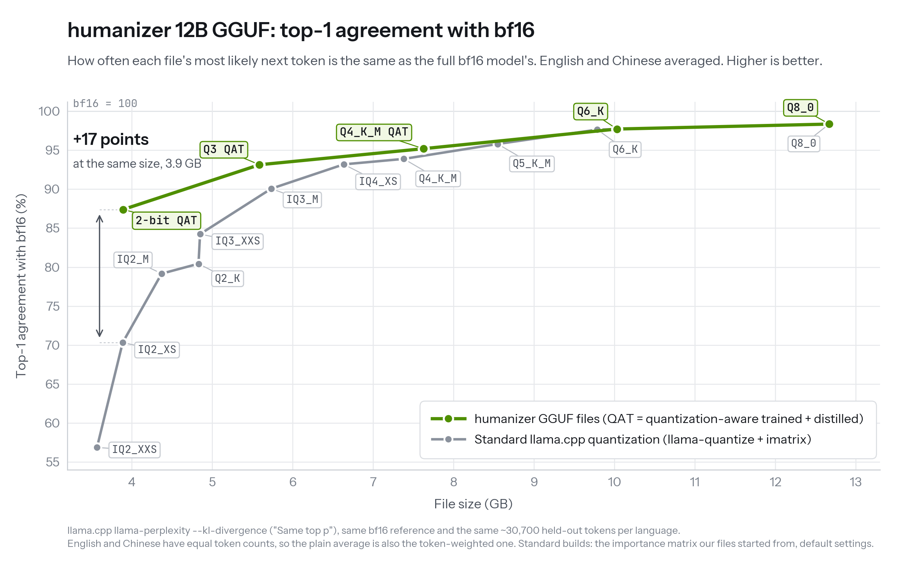

# Quantized files: quality and how they were made

[README](../README.md) · [中文](QUANTIZATION.zh.md) · [GGUF repo on Hugging Face](https://huggingface.co/jialinyyzz/humanizer-GGUF)

humanizer 12B (v2) comes as five GGUF files, from 12.7 GB down to 3.9 GB, in [`jialinyyzz/humanizer`](https://huggingface.co/jialinyyzz/humanizer) and, byte for byte the same, in [`jialinyyzz/humanizer-GGUF`](https://huggingface.co/jialinyyzz/humanizer-GGUF). This page has the numbers behind the chart, what each file costs in quality, and how the files were made.

Also as [SVG](../assets/quant-top1-en.svg). Data: [`assets/data/quant-top1.csv`](../assets/data/quant-top1.csv).

## Why these files are better than a plain quantization

Most GGUF files come from one `llama-quantize` pass that rounds every weight to the target type; our 2-bit, Q3 and Q4_K_M files go further. In the 2-bit and Q3 files, we measured how much each weight tensor hurts the model when it is squeezed and gave the sensitive tensors more bits and the robust ones fewer (the Q3 file mixes 2-, 3-, 4- and 6-bit types). All three were then trained layer by layer to reproduce the full model (quantization-aware training) and distilled from the full bf16 model, used as the teacher, on English and Chinese rewriting data. Each step adds up, as the tables below show. The result is still an ordinary GGUF that any recent llama.cpp runs; Q6_K and Q8_0 are standard builds, because at those sizes there is almost nothing left to recover.

### What each step adds

Same file size at every step; top-1 agreement with bf16 (English / Chinese, and their average) and KL to bf16 (lower is better).

| 2-bit file, 3.9 GB | Top-1, EN / ZH (average) | KL, EN / ZH |
|---|---|---|
| Standard `llama-quantize` IQ2_XS of the same size, for comparison | 74.4% / 66.2% (70.3%) | 0.471 / 0.760 |
| 1. Bits spread by sensitivity (mixed-precision start) ¹ | 81.9% / 79.4% (80.6%) | 0.217 / 0.272 |
| 2. + layer-by-layer quantization-aware training | 85.9% / 84.9% (85.4%) | 0.134 / 0.138 |
| 3. + distillation from bf16 = **the released file** | **87.7% / 87.1% (87.4%)** | **0.106 / 0.106** |

| Q3 file, 5.6 GB | Top-1, EN / ZH (average) | KL, EN / ZH |
|---|---|---|
| Standard `llama-quantize` IQ3_M, 5.7 GB (a little larger), for comparison | 90.9% / 89.2% (90.1%) | 0.056 / 0.067 |
| 1. Bits spread by sensitivity (mixed-precision start) ¹ | 91.8% / 89.7% (90.8%) | 0.045 / 0.060 |
| 2. + layer-by-layer quantization-aware training | 93.0% / 92.1% (92.5%) | 0.034 / 0.037 |
| 3. + distillation from bf16 = **the released file** | **93.6% / 92.6% (93.1%)** | **0.030 / 0.032** |

¹ The start also drops vocabulary rows that English and Chinese text never use (see [How the files were made](#how-the-files-were-made)), which frees a little room for the weights.

The Q4_K_M file went through steps 2 and 3 on the standard Q4_K_M type (no mixed precision): 94.5% / 93.5% → 95.6% / 94.8%, KL 0.0203 / 0.0225 → 0.0136 / 0.0146, same size and format.

## The files

| File | Size | Peak memory (Mac) ² | Top-1 vs. bf16, EN / ZH (average) ³ | KL to bf16, EN / ZH ³ | Fact check (GLM): rewrites flagged · spots listed ⁴ | Flagged as AI, same 60 drafts ⁵ |
|---|---|---|---|---|---|---|
| `humanizer-12b-bf16.gguf` | 23.8 GB | about 24.8 GB (est.) | 100% (reference) | 0 (reference) | EN 52 of 420 · 160 spots   ZH 50 of 200 · 216 spots | 4 / 60 |
| `humanizer-12b-Q8_0.gguf` | 12.7 GB | 13.7 GB | 98.4% / 98.3% (98.4%) | 0.0017 / 0.0016 | EN 44 · 135 spots   ZH 54 · 236 spots | 7 / 60 |
| `humanizer-12b-Q6_K.gguf` | 10.0 GB | about 11.0 GB (est.) | 98.0% / 97.5% (97.7%) | 0.0031 / 0.0035 | EN 56 · 153 spots   ZH 56 · 255 spots | not measured |
| `humanizer-12b-Q4_K_M.gguf` (quantization-aware trained) | 7.6 GB | 10.0 GB | 95.6% / 94.8% (95.2%) | 0.0136 / 0.0146 | EN 58 · 162 spots   ZH 51 · 194 spots | not measured |
| `humanizer-12b-Q3-QAT.gguf` | 5.6 GB | 8.0 GB | 93.6% / 92.6% (93.1%) | 0.030 / 0.032 | EN 64 · 210 spots   ZH 53 · 233 spots | 4 / 60 |
| `humanizer-12b-IQ2_XS-QAT.gguf` (2-bit) | 3.9 GB | 6.2 GB | 87.7% / 87.1% (87.4%) | 0.106 / 0.106 | EN 70 · 265 spots   ZH 66 · 361 spots | 0 / 60 |

In short: Q8_0 is the best; Q6_K shows no measurable loss; Q4_K_M a slight loss; Q3 a small loss, with a few more fact slips in English; the 2-bit file had the lowest AI-detector score of all, and a few more fact slips, so check numbers and names before you send. In the GGUF repo the Q3 file is named `humanizer-12b-IQ3_XXS-QAT.gguf` (same sha256 as `humanizer-12b-Q3-QAT.gguf`).

² Maximum resident memory of `llama-server` (llama.cpp, Metal) on an Apple M5 Max with the app's settings (8,192-token context, one request at a time) while rewriting. Q4_K_M, Q3 and 2-bit were measured side by side with the app's llama.cpp build on four real drafts; generation ran at about 52, 65 and 69 tokens per second. Q8_0 was measured in an earlier run on one 470-token draft, which read about 1.3 GB lower for the same file (2-bit: 4.9 GB there, 6.2 GB here), so it may need a little more than shown; Q6_K and bf16 are estimated (est.). A 32,768-token context adds about 0.4 GB. Leave room for the system and other apps (the app keeps about 4 GB free).

³ See [How it was measured](#how-it-was-measured).

⁴ The strict fact judge from the README (GLM-5.3, one vote per rewrite) on all 420 English and 204 Chinese rewrites of the held-out evaluation set (two per draft; for bf16, 4 Chinese rewrites could not be judged). "Rewrites flagged" = rewrites it found a factual problem in; a second pass re-read each flagged rewrite against its draft and listed every problem ("spots"). About 9 in 10 spots are a single word, number or phrase for every file (2-bit: 243 of 265 English, 330 of 361 Chinese; Q3: 191 of 210 English). Compared draft by draft with Q8_0, Q6_K and Q4_K_M are within noise, and the quantization-aware Q4_K_M is within noise of a standard Q4_K_M (English 56 · 163 spots, Chinese 48 · 218). The 2-bit file is not: in English it was flagged on 70 rewrites against 44 for Q8_0 on the same drafts, a difference beyond noise; in Chinese 66 against 54, within noise. Q3 sits in between: 64 English rewrites flagged (bf16 52, Q4_K_M 58); in Chinese 53, on par with bf16 (50). The judge is deliberately strict and some flags are harmless rewording, but with any file, read numbers, dates and names before you send.

⁵ Originality.ai, strictest setting (AI Allowance 0%), on the same 60 English drafts. The 2-bit file had 0 of 60 flagged, against 7 of 60 for Q8_0 and 4 of 60 for bf16: all 7 drafts flagged for Q8_0 passed with the 2-bit file and none went the other way (paired p = 0.016). A likely reason: the small drift that quantization adds makes the wording a little less predictable, so it reads less machine-like. Q3: 4 of 60, the same as bf16 (3 drafts flagged only with Q3, 3 only with bf16). Detectors change; this is one measurement on one date.

## Compared with standard quantization

The gray line in the chart is what plain llama.cpp quantization gives for this model: a `llama-quantize` run of each type with the same importance matrix our 2-bit and Q3 files started from, full vocabulary, every other setting at its default. Every point on both lines is a measured file; nothing is interpolated.

| Line | File / type | Size | Top-1, EN | Top-1, ZH | Average (plotted) | KL, EN / ZH |
|---|---|---|---|---|---|---|
| **ours** | 2-bit (`IQ2_XS-QAT`) | 3.89 GB | 87.72% | 87.07% | **87.40%** | 0.106 / 0.106 |
| **ours** | Q3 (`Q3-QAT`) | 5.59 GB | 93.63% | 92.64% | **93.13%** | 0.030 / 0.032 |
| **ours** | Q4_K_M, quantization-aware trained | 7.63 GB | 95.62% | 94.77% | **95.20%** | 0.0136 / 0.0146 |
| **ours** | Q6_K (standard build, our calibration) | 10.03 GB | 97.95% | 97.48% | **97.72%** | 0.0031 / 0.0035 |
| **ours** | Q8_0 (standard build) | 12.67 GB | 98.45% | 98.25% | **98.35%** | 0.0017 / 0.0016 |
| standard | IQ2_XXS | 3.57 GB | 67.89% | 45.84% | 56.86% | 0.823 / 2.268 |
| standard | IQ2_XS | 3.89 GB | 74.44% | 66.21% | 70.32% | 0.471 / 0.760 |
| standard | IQ2_M | 4.37 GB | 81.55% | 76.78% | 79.16% | 0.245 / 0.367 |
| standard | Q2_K | 4.83 GB | 82.03% | 78.84% | 80.44% | 0.224 / 0.303 |
| standard | IQ3_XXS | 4.85 GB | 85.70% | 82.77% | 84.23% | 0.136 / 0.185 |
| standard | IQ3_M | 5.73 GB | 90.94% | 89.19% | 90.07% | 0.056 / 0.067 |
| standard | IQ4_XS | 6.64 GB | 93.79% | 92.58% | 93.19% | 0.026 / 0.029 |
| standard | Q4_K_M | 7.38 GB | 94.32% | 93.45% | 93.89% | 0.021 / 0.023 |
| standard | Q5_K_M | 8.55 GB | 95.98% | 95.62% | 95.80% | 0.011 / 0.011 |
| standard | Q6_K | 9.79 GB | 97.87% | 97.41% | 97.64% | 0.0033 / 0.0035 |
| standard | Q8_0 | 12.67 GB | 98.50% | 98.24% | 98.37% | 0.0015 / 0.0019 |

Also measured, not on the chart: standard IQ1_M (3.20 GB, 52.86% / 39.10%), which is smaller than any file here, and standard Q3_K_M (6.09 GB, 89.98% / 88.23%), which is beaten by the smaller IQ3_M. Both are in the CSV.

- **2-bit:** 17 points above the standard IQ2_XS of the same size, and above the standard IQ3_XXS that is 1 GB larger (84.2%). Plain 2-bit quantization hurts Chinese much more than English (66.2% vs. 74.4% top-1, KL 0.76 vs. 0.47); in our file the two languages come out the same.
- **Q3:** above the standard IQ3_M, which is a little larger (93.1% vs. 90.1%), and level with the standard IQ4_XS, which is 1.0 GB larger (93.2%).
- **Q4_K_M:** the gain is real but small: 95.2% vs. 93.9% for the standard Q4_K_M. A standard Q5_K_M (8.5 GB, 95.8%) is still a little closer to bf16. (The standard Q4_K_M on the chart is 7.4 GB because llama-quantize's default keeps the embeddings at 6-bit; with 8-bit embeddings like ours it is 7.6 GB: 94.46% / 93.46%, KL 0.0203 / 0.0225.)
- **Q6_K and Q8_0** are standard builds, so they sit on the standard line.

## How the files were made

- **Our own calibration.** Q6_K, Q4_K_M, Q3 and the 2-bit file use an importance matrix (imatrix) computed on our own English and Chinese rewriting data, not on generic web text (the one for Q3 and 2-bit also mixes in some general text). Q8_0 needs no imatrix.
- **Embeddings and output layer stay at 8-bit** in Q8_0, Q6_K and Q4_K_M (the model ties them, so this is one tensor).
- **Mixed precision by sensitivity (Q3 and 2-bit).** Starting from an all-low-bit build, each tensor was upgraded on its own to a higher-bit type and the drop in KL to bf16 was measured; the bits then went where they buy the most, within a file-size budget. The 2-bit file is, by bytes, about half IQ2_XS and a quarter IQ3_XXS, with Q4_K (including the embeddings) and a little 3- and 6-bit where it matters most: about 2.7 bits per weight on average, in the same file size as a standard IQ2_XS. The Q3 file is about half Q4_K and a fifth Q6_K, with IQ3_XXS (17%) and IQ2_XS (11%) on the least sensitive tensors: about 3.9 bits per weight. Their headers say IQ2_XS and IQ3_XXS, the base type each build started from, but neither is a plain build of that type.
- **Quantization-aware training (Q4_K_M, Q3 and 2-bit).** Layer by layer, the quantized weights are trained to reproduce the output of the same layer in the bf16 model. What is trained is exactly what is saved: every exported file was checked value by value against the trained weights.
- **Distillation (Q4_K_M, Q3 and 2-bit).** The bf16 model is the teacher: the quantization scales and norms of the whole quantized model are trained to match its next-token probabilities on English and Chinese rewriting data.
- **Vocabulary pruning (Q3 and 2-bit).** The files keep about 130,000 of the 262,144 tokens: the ones English and Chinese text actually uses, plus everything needed to spell any input. Any text still encodes and decodes exactly; rare symbols, emoji and other scripts just take a few more tokens.
- **Ordinary GGUF.** No custom kernels and no new tensor types: any recent llama.cpp, and apps built on it, run the files.

## How it was measured

- **Tool:** llama.cpp `llama-perplexity --kl-divergence`, 30 chunks of 2,048 tokens per language (about 30,700 scored tokens each) of held-out drafts and rewrites from the evaluation set, with no overlap with calibration or training data. Reference = the bf16 GGUF.
- **Top-1 agreement** is the "Same top p" line of that output: how often the file and bf16 would pick the same most likely next token. It is the same quantity some providers call top-1 accuracy. **KL** is how far the file's next-token probabilities drift from bf16, averaged over every token; lower is better, 0 means identical.
- **English and Chinese combined:** the chart plots the plain average of the two. Both languages have the same number of scored tokens, so this is also the token-weighted average.
- **Pruned vocabulary:** the Q3 and 2-bit files are measured against a bf16 with the same pruned vocabulary. Pruning on its own moves the model by a KL of 0.0013 (English) / 0.0002 (Chinese), and bf16's first choice is a removed token at only 0.12% / 0.01% of positions.
- **GPUs:** measured on A100 and A30 GPUs. The same file measures within about 3% in KL across GPU models, far below the gaps between files.
- **Data:** the chart's numbers, per language, are in [`assets/data/quant-top1.csv`](../assets/data/quant-top1.csv); the chart is drawn by [`assets/src/quant_chart.py`](../assets/src/quant_chart.py).

sha256 checksums: [USAGE.md, section 2](USAGE.md#2-pick-a-file).
