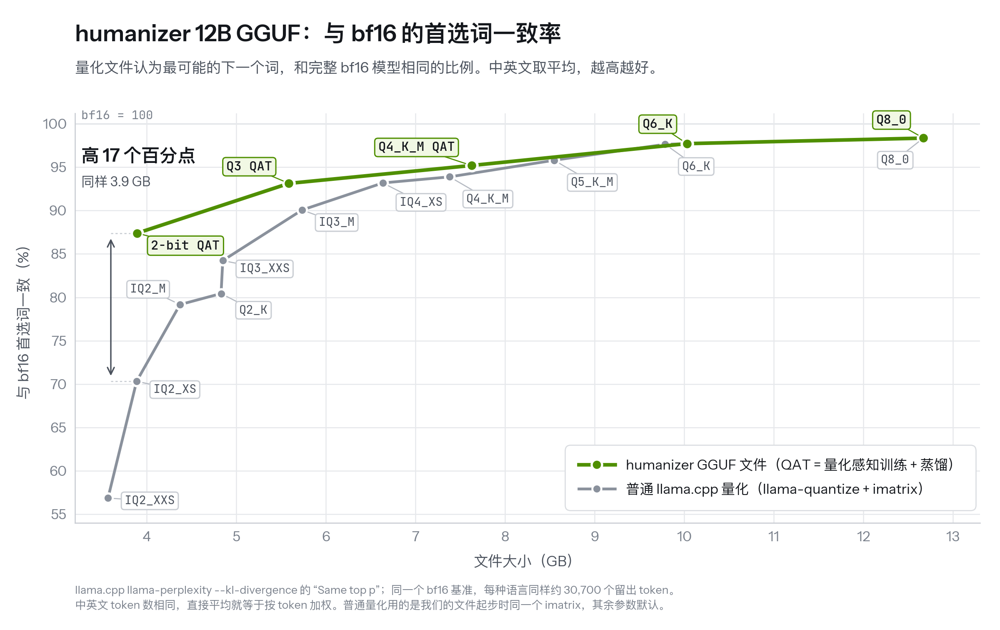

# 量化文件：质量和做法

[README](../README.zh.md) · [English](QUANTIZATION.md) · [Hugging Face 上的 GGUF 仓库](https://huggingface.co/jialinyyzz/humanizer-GGUF)

humanizer 12B（v2）有五个 GGUF 文件，从 12.7 GB 到 3.9 GB，放在 [`jialinyyzz/humanizer`](https://huggingface.co/jialinyyzz/humanizer)，[`jialinyyzz/humanizer-GGUF`](https://huggingface.co/jialinyyzz/humanizer-GGUF) 里也有一份逐字节相同的。这一页是图背后的数字、每个文件损失多少质量，以及它们是怎么做出来的。

另有 [SVG 版](../assets/quant-top1-zh.svg)。数据：[`assets/data/quant-top1.csv`](../assets/data/quant-top1.csv)。

## 为什么比普通量化好

大多数 GGUF 都是 `llama-quantize` 一步量出来的，把每个权重直接取整到目标类型；我们的 2-bit、Q3 和 Q4_K_M 多做了几步。2-bit 和 Q3 先逐个张量测它被压缩后对模型的影响有多大，敏感的张量多给位数，不敏感的少给（Q3 文件里 2、3、4、6 bit 的类型都有）。三个文件都再逐层训练，让量化后的模型去贴近完整模型的输出（量化感知训练），最后用完整的 bf16 模型当老师，在中英文改写数据上做蒸馏。每一步都有实打实的提升，见下表。产出的仍是普通 GGUF，任何新版 llama.cpp 都能直接跑；Q6_K 和 Q8_0 是普通量化，因为在这个大小已经几乎没有损失可以找回。

### 每一步各带来多少

每一步文件大小都不变；首选词一致率（英 / 中，括号里是平均）和与 bf16 的 KL（越低越好）。

| 2-bit 文件，3.9 GB | 首选词一致，英 / 中（平均） | KL，英 / 中 |
|---|---|---|
| 对照：同样大小的普通 `llama-quantize` IQ2_XS | 74.4% / 66.2%（70.3%） | 0.471 / 0.760 |
| 1. 按敏感度分配位数（混合精度起点）¹ | 81.9% / 79.4%（80.6%） | 0.217 / 0.272 |
| 2. + 逐层量化感知训练 | 85.9% / 84.9%（85.4%） | 0.134 / 0.138 |
| 3. + 从 bf16 蒸馏 = **发布的文件** | **87.7% / 87.1%（87.4%）** | **0.106 / 0.106** |

| Q3 文件，5.6 GB | 首选词一致，英 / 中（平均） | KL，英 / 中 |
|---|---|---|
| 对照：普通 `llama-quantize` IQ3_M，5.7 GB（略大） | 90.9% / 89.2%（90.1%） | 0.056 / 0.067 |
| 1. 按敏感度分配位数（混合精度起点）¹ | 91.8% / 89.7%（90.8%） | 0.045 / 0.060 |
| 2. + 逐层量化感知训练 | 93.0% / 92.1%（92.5%） | 0.034 / 0.037 |
| 3. + 从 bf16 蒸馏 = **发布的文件** | **93.6% / 92.6%（93.1%）** | **0.030 / 0.032** |

¹ 起点同时去掉了中英文从来用不到的词表行（见[文件是怎么做的](#文件是怎么做的)），给权重腾出一点空间。

Q4_K_M 是在普通 Q4_K_M 类型上做了第 2、3 步（没有混合精度）：首选词一致 94.5% / 93.5% → 95.6% / 94.8%，KL 0.0203 / 0.0225 → 0.0136 / 0.0146，大小和格式不变。

## 各个文件

| 文件 | 大小 | Mac 峰值内存 ² | 与 bf16 首选词一致，英 / 中（平均）³ | 与 bf16 的 KL，英 / 中 ³ | 事实检查（GLM）：标出篇数 · 列出几处 ⁴ | 同 60 篇被判 AI ⁵ |
|---|---|---|---|---|---|---|
| `humanizer-12b-bf16.gguf` | 23.8 GB | 约 24.8 GB（估） | 100%（基准） | 0（基准） | 英 420 篇里 52 篇 · 160 处   中 200 篇里 50 篇 · 216 处 | 4 / 60 |
| `humanizer-12b-Q8_0.gguf` | 12.7 GB | 13.7 GB | 98.4% / 98.3%（98.4%） | 0.0017 / 0.0016 | 英 44 篇 · 135 处   中 54 篇 · 236 处 | 7 / 60 |
| `humanizer-12b-Q6_K.gguf` | 10.0 GB | 约 11.0 GB（估） | 98.0% / 97.5%（97.7%） | 0.0031 / 0.0035 | 英 56 篇 · 153 处   中 56 篇 · 255 处 | 未测 |
| `humanizer-12b-Q4_K_M.gguf`（量化感知训练） | 7.6 GB | 10.0 GB | 95.6% / 94.8%（95.2%） | 0.0136 / 0.0146 | 英 58 篇 · 162 处   中 51 篇 · 194 处 | 未测 |
| `humanizer-12b-Q3-QAT.gguf` | 5.6 GB | 8.0 GB | 93.6% / 92.6%（93.1%） | 0.030 / 0.032 | 英 64 篇 · 210 处   中 53 篇 · 233 处 | 4 / 60 |
| `humanizer-12b-IQ2_XS-QAT.gguf`（2-bit） | 3.9 GB | 6.2 GB | 87.7% / 87.1%（87.4%） | 0.106 / 0.106 | 英 70 篇 · 265 处   中 66 篇 · 361 处 | 0 / 60 |

一句话：Q8_0 最好；Q6_K 测不出损失；Q4_K_M 略有损失；Q3 小幅损失，英文事实小错略多；2-bit 的 AI 检测结果是所有版本里最好的，事实小错多一些，发出前核对数字和名字。GGUF 仓库里 Q3 文件叫 `humanizer-12b-IQ3_XXS-QAT.gguf`（和 `humanizer-12b-Q3-QAT.gguf` 的 sha256 相同）。

² llama-server（llama.cpp，Metal）在 Apple M5 Max 上、用 App 的设置（8,192 token 上下文，一次一个请求）改写时的最大常驻内存。Q4_K_M、Q3、2-bit 是用 App 自带的 llama.cpp 在四篇真实草稿上放在一起实测的，生成速度约每秒 52、65、69 个 token。Q8_0 是更早一轮在一篇 470 token 草稿上测的，那一轮同一个文件读数低约 1.3 GB（2-bit：那轮 4.9 GB，这轮 6.2 GB），所以 Q8_0 实际可能比表里略多；Q6_K 和 bf16 是估算（估）。上下文开到 32,768 token 约多 0.4 GB。另外要给系统和其他程序留出空间（App 会留约 4 GB）。

³ 见[怎么测的](#怎么测的)。

⁴ 用 README 里那个从严的事实判官（GLM-5.3，每篇一票）判留出评测集的全部 420 篇英文、204 篇中文改写（每篇草稿两发；bf16 有 4 篇中文没判出结果）。"标出篇数"是判官认为有事实问题的改写篇数；第二遍把每篇标出的改写和草稿对照重读，列出每一处问题（"几处"）。每个文件都有约 9 成只是一个词、一个数字或一个短语（2-bit：英文 265 处里 243 处，中文 361 处里 330 处；Q3：英文 210 处里 191 处）。和 Q8_0 逐篇对比，Q6_K、Q4_K_M 都在噪声范围内，量化感知训练版 Q4_K_M 和普通 Q4_K_M（英 56 篇 · 163 处，中 48 篇 · 218 处）也在噪声范围内。2-bit 不是：同一批草稿上英文标出 70 篇，Q8_0 是 44 篇，差别超出噪声；中文 66 对 54，在噪声范围内。Q3 介于两者之间：英文标出 64 篇（bf16 52，Q4_K_M 58）；中文 53 篇，和 bf16（50）持平。判官是故意设得从严的，有些被标出的地方只是无害的措辞变化；但不管用哪个文件，发出前都请读一遍数字、日期和人名。

⁵ Originality.ai 最严档（AI Allowance 0%），同一批 60 篇英文草稿。2-bit 文件 60 篇里 0 篇被判 AI，Q8_0 是 7 篇，bf16 是 4 篇：Q8_0 被判 AI 的 7 篇，换成 2-bit 全部通过，反过来一篇都没有（配对检验 p = 0.016）。可能的原因是量化带来的细微漂移让措辞没那么好预测，读起来就不那么像机器写的。Q3：4 / 60，和 bf16 一样（只在 Q3 被判的 3 篇，只在 bf16 被判的 3 篇）。检测器会更新，这只是某一天的一次测量。

## 和普通量化比

图里的灰线是这个模型用普通 llama.cpp 量化能得到的结果：每种类型跑一次 `llama-quantize`，用的是我们的 2-bit 和 Q3 起步时同一个 imatrix，完整词表，其余参数都是默认值。两条线上的每个点都是实测的文件，没有插值。

| 线 | 文件 / 类型 | 大小 | 首选词一致，英 | 首选词一致，中 | 平均（画在图上） | KL，英 / 中 |
|---|---|---|---|---|---|---|
| **我们的** | 2-bit（`IQ2_XS-QAT`） | 3.89 GB | 87.72% | 87.07% | **87.40%** | 0.106 / 0.106 |
| **我们的** | Q3（`Q3-QAT`） | 5.59 GB | 93.63% | 92.64% | **93.13%** | 0.030 / 0.032 |
| **我们的** | Q4_K_M，量化感知训练 | 7.63 GB | 95.62% | 94.77% | **95.20%** | 0.0136 / 0.0146 |
| **我们的** | Q6_K（普通量化，我们自己校准） | 10.03 GB | 97.95% | 97.48% | **97.72%** | 0.0031 / 0.0035 |
| **我们的** | Q8_0（普通量化） | 12.67 GB | 98.45% | 98.25% | **98.35%** | 0.0017 / 0.0016 |
| 普通 | IQ2_XXS | 3.57 GB | 67.89% | 45.84% | 56.86% | 0.823 / 2.268 |
| 普通 | IQ2_XS | 3.89 GB | 74.44% | 66.21% | 70.32% | 0.471 / 0.760 |
| 普通 | IQ2_M | 4.37 GB | 81.55% | 76.78% | 79.16% | 0.245 / 0.367 |
| 普通 | Q2_K | 4.83 GB | 82.03% | 78.84% | 80.44% | 0.224 / 0.303 |
| 普通 | IQ3_XXS | 4.85 GB | 85.70% | 82.77% | 84.23% | 0.136 / 0.185 |
| 普通 | IQ3_M | 5.73 GB | 90.94% | 89.19% | 90.07% | 0.056 / 0.067 |
| 普通 | IQ4_XS | 6.64 GB | 93.79% | 92.58% | 93.19% | 0.026 / 0.029 |
| 普通 | Q4_K_M | 7.38 GB | 94.32% | 93.45% | 93.89% | 0.021 / 0.023 |
| 普通 | Q5_K_M | 8.55 GB | 95.98% | 95.62% | 95.80% | 0.011 / 0.011 |
| 普通 | Q6_K | 9.79 GB | 97.87% | 97.41% | 97.64% | 0.0033 / 0.0035 |
| 普通 | Q8_0 | 12.67 GB | 98.50% | 98.24% | 98.37% | 0.0015 / 0.0019 |

另外测过、但没画在图上的：普通 IQ1_M（3.20 GB，52.86% / 39.10%），比这里任何文件都小；普通 Q3_K_M（6.09 GB，89.98% / 88.23%），比它更小的 IQ3_M 反而更好。两者都在 CSV 里。

- **2-bit**：比同样大小的普通 IQ2_XS 高 17 个百分点，也高于大 1 GB 的普通 IQ3_XXS（84.2%）。普通 2-bit 量化伤中文比伤英文狠得多（首选词一致 66.2% 对 74.4%，KL 0.76 对 0.47）；我们的文件中英文一样好。
- **Q3**：高于略大一点的普通 IQ3_M（93.1% 对 90.1%），和大 1.0 GB 的普通 IQ4_XS（93.2%）持平。
- **Q4_K_M**：提升是真的，但不大：95.2% 对普通 Q4_K_M 的 93.9%。普通 Q5_K_M（8.5 GB，95.8%）还是比它更接近 bf16。（图上的普通 Q4_K_M 是 7.4 GB，因为 llama-quantize 默认把词表放在 6 bit；像我们一样把词表留在 8 bit，它是 7.6 GB：94.46% / 93.46%，KL 0.0203 / 0.0225。）
- **Q6_K 和 Q8_0** 是普通量化，所以和普通量化那条线重合。

## 文件是怎么做的

- **用我们自己的数据校准**。Q6_K、Q4_K_M、Q3 和 2-bit 用的 imatrix 是在我们自己的中英文改写数据上算的，不是通用网页文本（Q3 和 2-bit 那份里另外混了一些通用文本）。Q8_0 不需要 imatrix。
- **词表和输出层留在 8 bit**（Q8_0、Q6_K、Q4_K_M；这个模型的两者共用一个张量）。
- **按敏感度分配位数（Q3 和 2-bit）**。从一个全低比特的版本出发，每次只把一个张量单独升到更高位的类型，量它让与 bf16 的 KL 降了多少；再在文件大小的预算内，把位数花在最划算的地方。2-bit 文件按字节算约一半是 IQ2_XS、四分之一是 IQ3_XXS，其余是 Q4_K（含词表），最关键处还有少量 3 bit 和 6 bit：平均约 2.7 bit/权重，文件大小和普通 IQ2_XS 相同。Q3 文件约一半是 Q4_K、五分之一是 Q6_K，最不敏感的张量用 IQ3_XXS（17%）和 IQ2_XS（11%）：平均约 3.9 bit/权重。两个文件头里分别写着 IQ2_XS 和 IQ3_XXS，那是它们起步时的基础类型，但都不是该类型的普通量化。
- **量化感知训练（Q4_K_M、Q3 和 2-bit）**。逐层训练量化后的权重，让每一层的输出去贴近 bf16 模型同一层的输出。训练的就是最后存进文件的东西：每个导出的文件都和训练时的权重逐值核对过。
- **蒸馏（Q4_K_M、Q3 和 2-bit）**。bf16 模型当老师：在中英文改写数据上，训练整个量化模型的缩放系数和归一化层，让它预测下一个词的概率去贴近老师。
- **裁词表（Q3 和 2-bit）**。保留了 262,144 个词表 token 里的约 13 万个：中英文实际用到的，加上拼出任何输入所需的全部。任何文本都能原样编码、解码；罕见符号、emoji 和其他文字只是多占几个 token。
- **仍是普通 GGUF**。没有自定义算子，也没有新的张量类型：任何新版 llama.cpp 和基于它的软件都能直接跑。

## 怎么测的

- **工具**：llama.cpp `llama-perplexity --kl-divergence`，每种语言 30 块、每块 2,048 token（各约 30,700 个打分 token），取自评测集里没参与校准和训练的草稿与改写。基准是 bf16 GGUF。
- **首选词一致**就是这条命令输出里的 "Same top p"：量化文件和 bf16 选中同一个最可能的下一个词的比例，也就是有些量化发布者说的 top-1 准确率。**KL** 是量化文件预测下一个词的概率和 bf16 差多远，在每个 token 上取平均；越低越好，0 就是完全一样。
- **中英文怎么合成一个数**：图上画的是两种语言的直接平均。两种语言打分的 token 数相同，所以这也就是按 token 加权的平均。
- **裁过词表的文件**：Q3 和 2-bit 是对着同样裁过词表的 bf16 测的。裁词表本身让模型偏移 KL 0.0013（英）/ 0.0002（中），bf16 的首选词恰好是被删 token 的位置只占 0.12% / 0.01%。
- **显卡**：在 A100 和 A30 两种卡上测。同一个文件换卡型，KL 只差约 3%，远小于各文件之间的差距。
- **数据**：图上每个点分语言的数字都在 [`assets/data/quant-top1.csv`](../assets/data/quant-top1.csv)；图由 [`assets/src/quant_chart.py`](../assets/src/quant_chart.py) 画出。

sha256 校验值见 [USAGE.zh.md 第 2 节](USAGE.zh.md)。
